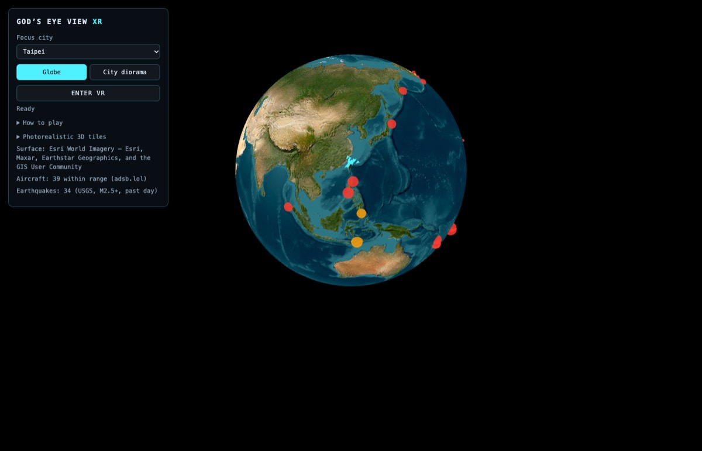
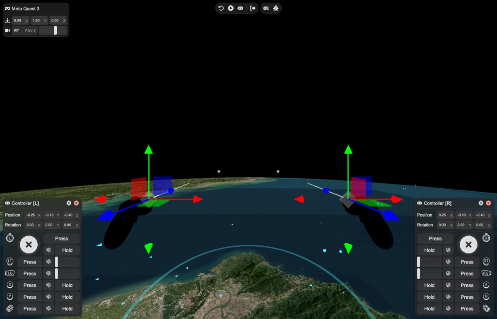
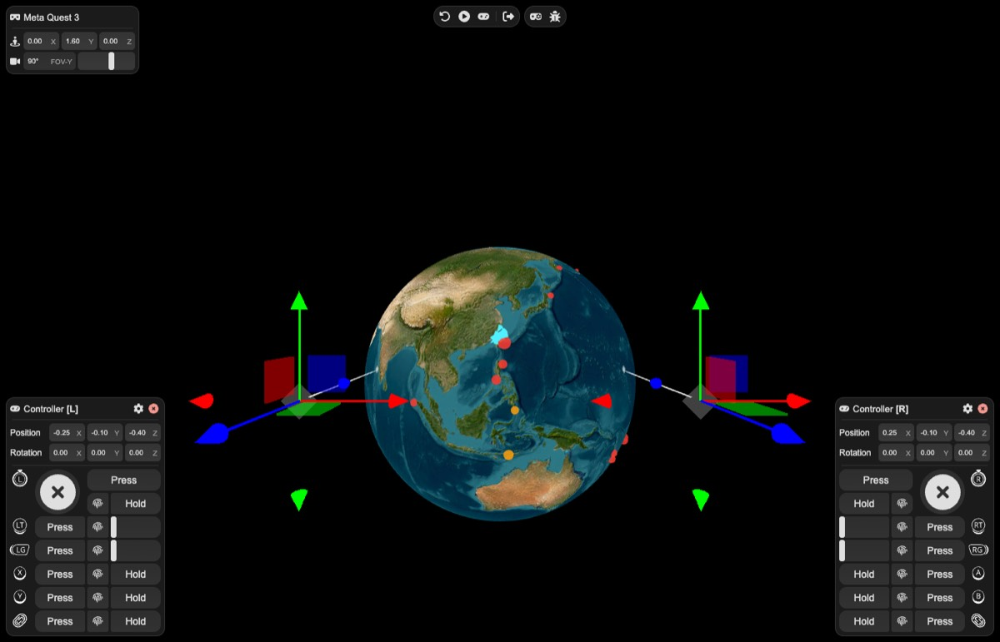
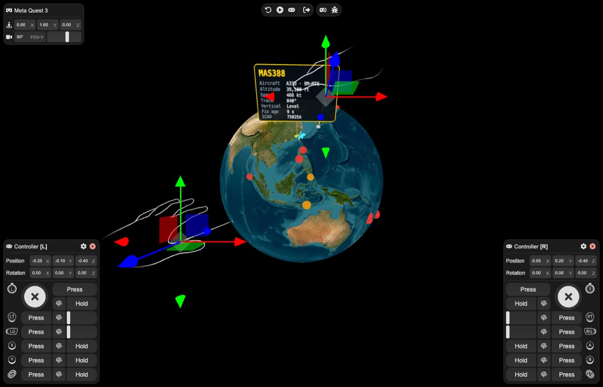
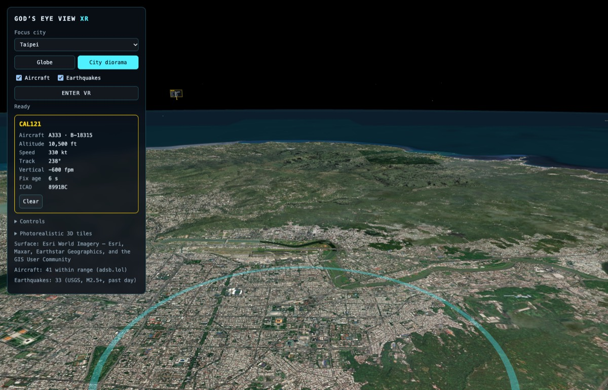

# 🥽 God's Eye View XR

A tabletop VR companion to God's Eye View: live aircraft and earthquakes on an
Earth you can grab, zoom, turn and inspect. It is built with Meta's
[Immersive Web SDK](https://github.com/facebook/immersive-web-sdk) (IWSDK) and
[3DTilesRendererJS](https://github.com/NASA-AMMOS/3DTilesRendererJS).

**No headset needed.** The site ships Meta's IWER emulator, so desktop Chrome
gets an emulated Quest 3 with on-screen controller panels. Quest Browser skips
the emulator and uses native WebXR.

| Globe (page view)                 | City diorama                          | Enter VR in Chrome (IWER)   |
| --------------------------------- | ------------------------------------- | --------------------------- |
|  |  |  |

| Emulated hands + aircraft card in VR            | Hovering an aircraft on the page            |
| ----------------------------------------------- | ------------------------------------------- |
|  |  |

This is a separate app from the desktop console in the repository root. It has
its own `package.json`, its own Vite 7 build and its own deployment. It shares
only the parent app's portable data sources (see
[Architecture](docs/ARCHITECTURE.md)).

---

## ⚡ Quick start

Use Node.js 20.19 or later (the desktop app in the repository root needs Node 24).

```bash
cd xr
npm ci
npm run dev        # http://localhost:4180
```

`npm run dev` also serves `/api/flights`, so live aircraft work locally without
any account or key.

| Script            | What it does                                                    |
| ----------------- | --------------------------------------------------------------- |
| `npm run dev`     | Vite dev server with the flights proxy and IWER on port 4180    |
| `npm run build`   | Production bundle in `dist/`, IWER included                     |
| `npm run preview` | Serve `dist/` with the flights proxy, the closest thing to prod |
| `npm test`        | Node test runner over `server/` and `src/` (`*.test.mjs`)       |
| `npm run e2e`     | Drives the emulated Quest 3 against `npm run dev` (see below)   |

## 🎮 Using it

1. Pick a **focus city**, a mode (**Globe** or **City diorama**) and the layers
   to show.
2. Hover an aircraft with the mouse to see its callsign, type, altitude, speed,
   track and fix age. The details appear in the panel and on a card over the
   aircraft.
3. Press **Enter VR**.

### In VR

| Input                      | Does                                                                          |
| -------------------------- | ----------------------------------------------------------------------------- |
| Aim a ray at the model     | Highlights it for grabbing                                                    |
| **Trigger** (hold) / pinch | Grab: move and turn the globe or diorama                                      |
| Aim a ray at an aircraft   | Opens its floating card (yellow); it stays until another aircraft is aimed at |
| Right **A**                | Switch Globe / City diorama                                                   |
| Right **B**                | Next city                                                                     |
| Left **X** / **Y**         | Aircraft / earthquakes on or off                                              |
| Left **thumbstick**        | Up/down zoom (0.25×–6×), left/right turn the model                            |

**Hands:** Quest hand tracking (and the emulator's hands) work too. Pinch acts
as the trigger, and the hand ray opens aircraft cards. Hands have no buttons,
so change the mode, city and layers on the page.

### Without a headset (desktop Chrome)

Enter VR opens an emulated Quest 3 (IWER). There are two ways to drive it:

- **Panels:** drag the red, green and blue arrows on a controller to aim it.
  In the controller panel, **Press** taps a button and **Hold** keeps it down.
  For example, aim at the globe, click **Hold** next to the trigger (RT), drag
  the arrows, then click it again to release.
- **Play mode (▶ in the top bar):** the mouse looks around with both
  controllers attached. **Left click = right trigger**, **Enter = A**,
  **Right Shift = B**, **X / Z = left X / Y**, and **W / S / A / D = left
  stick**.

Switch the emulator to **hands** from the controller icon in its top bar to
try pinch.

The URL keeps `?city=…&mode=…`, so a view can be shared as a link.

| Mode         | Scale                         | Best for                                                      |
| ------------ | ----------------------------- | ------------------------------------------------------------- |
| Globe        | Earth ≈ 70 cm across          | Worldwide earthquakes, traffic around a city                  |
| City diorama | 1 m on the table = 60 km real | Approach and departure traffic around a city and its airports |

**Finding aircraft:** they are the **cyan arrows** (grey when on the ground),
pointing along their track. The selected one turns **yellow**. Earthquakes
are the smaller red, orange and yellow dots (shallow, intermediate, deep).
Aircraft come from a 150 nm radius around the focus city:

- **Globe:** they form a cyan cluster over that city, lifted slightly off the
  surface.
- **Diorama:** they spread over and beyond the table. Altitude is exaggerated
  2×, so cruising traffic (~11 km) sits about 37 cm above the table.

The panel's **Aircraft** line gives the current count.

## 🌍 Surfaces and keys

| Surface                        | Key                      | Notes                                                 |
| ------------------------------ | ------------------------ | ----------------------------------------------------- |
| Esri World Imagery (default)   | none                     | Flat imagery draped on the ellipsoid; no 3D buildings |
| Google Photorealistic 3D Tiles | Google Maps Platform key | Real 3D cities; metered by Google, attribution shown  |

There are two ways to provide a Google key:

- **Per viewer:** paste it under **Photorealistic 3D tiles** on the page. It is
  stored in that browser's `localStorage` only and never reaches the server.
- **Site-wide:** set `VITE_GOOGLE_MAPS_API_KEY` at build time. The key is then
  embedded in the public JavaScript bundle, which is how Google's browser keys
  work. Restrict it to your site's HTTP referrers, enable only the **Map Tiles
  API**, and set a quota and budget alert before sharing the URL. See
  [Deploying](docs/DEPLOY.md#google-key).

## 🛰️ Data layers

| Layer       | Upstream                                                | Path                        | Refresh |
| ----------- | ------------------------------------------------------- | --------------------------- | ------- |
| Aircraft    | [adsb.lol](https://adsb.lol) point query, 150 nm radius | `/api/flights` proxy (CORS) | 15 s    |
| Earthquakes | USGS M2.5+ past day                                     | browser → USGS directly     | 5 min   |

Aircraft are dead-reckoned every frame between fixes, capped at 90 s. They use
the desktop app's readsb normalizer (`gods-eye-view/sources/live`), so fields
mean the same thing in both apps. Earthquakes reuse the desktop USGS source
(`gods-eye-view/layers/earthquakes/source`) and its depth colour bands.

## 🧪 Emulator end-to-end check

`npm run e2e` opens the dev server in headless Chrome and drives the emulated
Quest 3 from code. It checks, in order:

1. enter VR
2. trigger grab
3. left-stick zoom
4. grab from inside a zoomed globe
5. X layer toggle
6. aiming at an aircraft opens its card
7. hand-tracking pinch grab

Screenshots are saved to `$TMPDIR/gev-xr-e2e`.

```bash
npm run dev                                  # terminal 1
npm i --no-save puppeteer-core && npm run e2e   # terminal 2
```

It uses a dev-only `window.__gevXR` handle, which is not present in production
builds. Poses are set through the IWER DevUI's `window.transformHandles`,
because the DevUI rewrites device poses every frame.

## 🚀 Deploying

The recommended host is **Vercel**. It serves the static bundle and runs the
single `/api/flights` function. GitHub Pages cannot run that proxy, and
adsb.lol blocks direct browser reads. Full steps are in
[docs/DEPLOY.md](docs/DEPLOY.md).

## 🧱 Layout

```
xr/
├── index.html            # Page shell: #scene canvas host + #ui panel host
├── vite.config.js        # IWER injection, /api/flights dev middleware, parent-source aliases
├── vercel.json           # Vercel build + asset caching
├── api/flights.js        # Vercel Function → server/flights.js
├── server/flights.js     # adsb.lol proxy: validation, UA, CORS, edge cache
├── public/logo.svg
├── src/
│   ├── main.js           # Bootstrap: World, stage, layers, panel, per-frame system
│   ├── config.js         # Cities, modes, key + URL state
│   ├── styles.css
│   ├── geo/frames.js     # ECEF ⇄ tabletop frames, marker matrices, dead reckoning
│   ├── geo/picking.js    # Nearest-marker-to-ray picking (controller, hand or mouse)
│   ├── globe/tiles.js    # TilesRenderer: Google 3D Tiles or keyless Esri surface
│   ├── globe/stage.js    # Grabbable root that carries tiles + layers
│   ├── layers/           # flights.js, earthquakes.js (InstancedMesh in ECEF)
│   ├── ui/panel.js       # HTML control panel (outside the headset view)
│   ├── ui/infoCard.js    # Floating aircraft card (canvas texture), seen in VR and on the page
│   ├── ui/aircraftInfo.js# Record → callsign / altitude / speed rows
│   ├── xr/controls.js    # Controller mapping table → per-frame intents
│   └── xr/emulation.js   # IWER ↔ desktop Chrome XRWebGLBinding workaround
├── scripts/e2e-emulator.mjs  # Scripted grab / zoom / toggle / pick / pinch checks
└── docs/
    ├── ARCHITECTURE.md   # Frames, ownership, reuse rules, known limits
    └── DEPLOY.md         # Vercel, Google key, custom domain, alternatives
```

## ⚠️ Known limits

- **Bundle size.** The main chunk is about 7.7 MB (about 2 MB gzipped), because
  IWSDK is imported through its barrel and IWER ships in production. First load
  on slow connections takes a few seconds.
- **Flat keyless surface.** Without a Google key there are no 3D buildings or
  terrain relief.
- **No in-headset menu yet.** City, mode and layers change on the page or with
  the controller buttons. Hands therefore cannot switch them from inside VR.
  A spatial IWSDK panel is the next step (see
  [Architecture → Next steps](docs/ARCHITECTURE.md#next-steps)).
- **Not everything from the desktop app is here.** Only aircraft, with details,
  and earthquakes are ported. Satellites, ships, military traffic, CCTV,
  weather, the cockpit view, flight tracking/trails and voice are desktop-only
  for now. See [Architecture → Porting desktop features](docs/ARCHITECTURE.md#porting-desktop-features).
- **Regional aircraft only.** adsb.lol point queries cap at 250 nm, so the
  globe shows traffic around the focus city, not worldwide.
- IWSDK is a release candidate (`1.0.0-rc.2`) and is pinned exactly.
